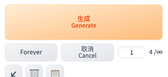
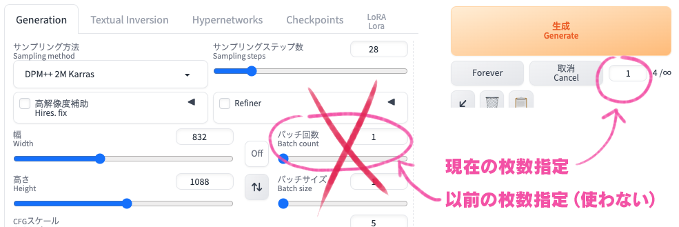

# D2 Generate Forever

## About

StableDiffusion webui AUTOMATIC1111やForge（以下 webui）で無限にイラストを生成するための機能拡張です。

- 生成中にプロンプト変更が反映できる！
  - 標準のBatch countを使うと生成中にプロンプトを変更しても反映されない
- [KohakuNAI](https://github.com/KohakuBlueleaf/Kohaku-NAI)で自動生成ができる！

## Feature

- 無限に画像生成できる
- 枚数上限が指定できる
- 待機時間、待機時間の振れ幅を設定できる（settings 👉 D2 Generate Forever）

## Upadte

- 2024.08.18
  - 上限指定に標準のBatch countを使わず、取り消しボタンの右の入力欄を使用
  - これによりローカル生成でも生成中のプロンプト変更を反映できるようになった

## Installation

1. "Extensions" タブを開く
2. "Install from URL" を開く
3. `https://github.com/da2el-ai/sd-d2-generate-forever` を "URL of the extension repository" に入力
4. "Install" をクリックしてインストールが完了するのを待つ
5. "Installed" を開き、"Apply and restart the UI" をクリック

## License

MIT
